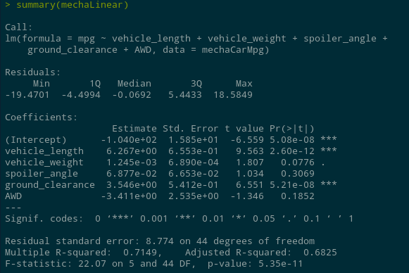

## Linear Regression to Predict MPG

  

Our goal in looking at at linear model in this case is to answer three questions:
1) Which variables/coefficients provided a non-random amount of variance to the mpg values in the dataset?

2) Is the slope of the linear model considered to be zero? Why or why not?

3) Does this linear model predict mpg of MechaCar prototypes effectively? Why or why not?

Running lm() on our data solving for Miles per Gallon(mpg), we used vehicle length, weight, spoiler angle, ground clearance and the car's all wheel drive stats to find the significance of each value on mpg. As a reminder, the higher the variance contribution on an independent variable, the less impact it will have.

<ul>
    <li><b>Vehicle Length</b>
        <ul>
            <li>Variability Contribution: negligiable (Pr < 0.1%)</li>
        </ul>
    </li>
    <li><b>Vehicle Weight</b>
        <ul>
            <li>Variability Contribution: 7.8%</li>
        </ul>
    </li>
    <li><b>Spoiler Angle</b>
        <ul>
            <li>Variability Contribution: 30.7%</li>
        </ul>
    </li>
    <li><b>Ground Clearance</b>
        <ul>
            <li>Variability Contribution: negligiable: (Pr < 0.1%)</li>
        </ul>
    </li>
    <li><b>All Wheel Drive</b>
        <ul>
            <li>Variability Contribution: 18.5%</li>
        </ul>
    </li>
    <li><b>P-Value</b>
        <ul>
            <li>0.00000000000535, which is negliable.</li>
            <li>P-Value < 0.05 <ul> <li>Null Hypothesis: rejected</ul></li>
</ul></ul>

<b>Question 1:</b>
    Vehicle Length and Ground Clearance have the least likely chance of providing random variance

<b>Question 2:</b>
    The slope should not be considered 0 because there are three independent variables that had significant contributions,

<b>Question 3:</b>
    If one considers a model that has ~70% prediction accuracy to be effective, then this would be an effective model (Multiple r-squared values of 0.714)