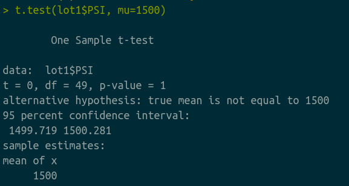
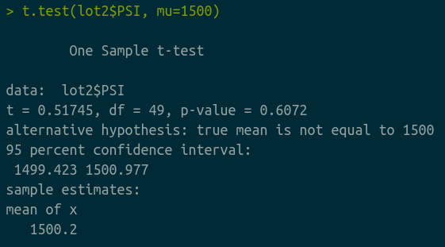

## Linear Regression to Predict MPG

  

The goal of this linear model is to answer three questions:
1) Which variables/coefficients provided a non-random amount of variance to the mpg values in the dataset?

2) Is the slope of the linear model considered to be zero? Why or why not?

3) Does this linear model predict mpg of MechaCar prototypes effectively? Why or why not?

Running lm() on our data solving for Miles per Gallon(mpg), we used vehicle length, weight, spoiler angle, ground clearance and the car's all wheel drive stats to find the significance of each value on mpg. As a reminder, the higher the variance contribution on an independent variable, the less impact it will have.

<ul>
    <li><b>Vehicle Length</b>
        <ul>
            <li>Variability Contribution: negligiable (Pr < 0.1%)</li>
        </ul>
    </li>
    <li><b>Vehicle Weight</b>
        <ul>
            <li>Variability Contribution: 7.8%</li>
        </ul>
    </li>
    <li><b>Spoiler Angle</b>
        <ul>
            <li>Variability Contribution: 30.7%</li>
        </ul>
    </li>
    <li><b>Ground Clearance</b>
        <ul>
            <li>Variability Contribution: negligiable: (Pr < 0.1%)</li>
        </ul>
    </li>
    <li><b>All Wheel Drive</b>
        <ul>
            <li>Variability Contribution: 18.5%</li>
        </ul>
    </li>
    <li><b>P-Value</b>
        <ul>
            <li>0.00000000000535, which is negliable.</li>
            <li>P-Value < 0.05 <ul> <li>Null Hypothesis: rejected</ul></li>
</ul></ul>

<b>Question 1:</b>
    Vehicle Length and Ground Clearance have the least likely chance of providing random variance

<b>Question 2:</b>
    The slope should not be considered 0 because there are three independent variables that had significant contributions,

<b>Question 3:</b>
    If one considers a model that has ~70% prediction accuracy to be effective, then this would be an effective model (Multiple r-squared values of 0.714)

## Summary Statistics on Suspension Coils

Here we look at 150 different vehicles which are assigned to one of 3 lots, all with unique IDs. The only data we have associated with each vehicle is the pressure on the suspension coils.  We're going to look some fairly general states of the lots and of the batch of 150 vehicles, specifically the mean, median, variance, and to a lesser extend the standard deviations.  We also want to answer a specific question:
<ul><li>The design specifications for the MechaCar suspension coils dictate that the variance of the suspension coils must not exceed 100 pounds per square inch. Does the current manufacturing data meet this design specification for all manufacturing lots in total and each lot individually? Why or why not</li></ul>

While the overall variance, as shown in the Total Summary data above, is under 100 psi and meets specifications, there is a problem with one of the individual lots. As shown in the Lot Summary stats, the variance for Lot 3 is well over the acceptable threshold, at 170.28.

## T-Tests on Suspension Coils
### One-Sample T-Test on all vehicles

### One-Sample T-Test on Lot 1 vehicles

### One-Sample T-Test on Lot 2 vehicles

### One-Sample T-Test on Lot 3 vehicles

### Summary of T-tests
A t test on all the lots shows a p-value of over 0.05 which means we cannot reject the null hypothesis.  However, while Lots 1 and 2 were above our specification range (p-values < 0.05), Lot 3 had a p-value of 0.041 which does give us reason to have an alternative hypothesis about the vehicles in lot 3 having relationship in the lower average PSI, which would invite further scrutiny.

## Study Design: MechCar vs Competition
Questions we should answer if we want to have a grasp on commodity differences between MechCar and it's competition:

    What metric or metrics are you going to test?
    What is the null hypothesis or alternative hypothesis?
    What statistical test would you use to test the hypothesis? And why?
    What data is needed to run the statistical test?

We would need to narrow down our metrics and a good place to start would be either fuel efficiencies (these are often price points that are very import to daily operations and part of any budgetary consideration) or carrying capacity (which are usually highly correllated with suspension coils as engineers after use one to inform the other).

Our hyptheses would be:
 - H₀: for the budget, it would be that the class of the car has no relevance to the fuel efficiency and the carrying capacity would be that carrying capacity among the class of car does is not predicted by manufacturer
 - Hₐ: for the budget, it would be that fuel efficiency is partly dependent on the class of the car and likewise carrying capcity is predicted by the manufacturer

The best test I would use would be a two sample t test since I would be drawing samples from many different data sets such as among different competitors.  Data needed would include fuel efficiency data with car class data from a general dataset and car class data paired with manufacturer data.
